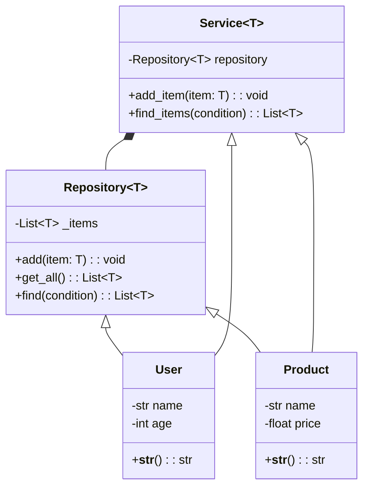

# Using Generics in Python

Python, as a language, doesn't have built-in support for generics in the same 
way languages like Java or C# do. However, starting with Python 3.5, the `typing` 
module was introduced, which has some support for generic programming concepts 
through type hinting. The `typing` module can help enforce and understand how 
types are supposed to be used throughout your code, although it's not strictly 
enforced at runtime in the same manner as statically typed languages.

### Basics of Generics in Python

Generics allow you to write code that works with different data types while providing 
type safety. It's particularly useful in collection types and functions that operate 
on data where the type may vary.

#### Using `Generic` and `TypeVar`

1. **`TypeVar`**: This is used to define a placeholder for a type that will be specified 
later. It can be seen as a way to indicate that multiple uses of this type parameter 
in the input/output must all be the same concrete type.

2. **`Generic`**: This is used as a base class to specify that a class will use one or 
several `TypeVar` parameters.


Here's how you use them:

```python
from typing import TypeVar, Generic, List

# Define a type variable
T = TypeVar('T')

# Create a generic class using the type variable
class Box(Generic[T]):
    def __init__(self, content: T) -> None:
        self.content = content
    
    def get_content(self) -> T:
        return self.content
```

Here, `Box` is a generic class that can hold any type of item, as defined by `T`.

### Example 1: A Simple Generic Data Structure

Let's build a simple set of classes modeling a generic repository and a fitting service.

```python
from typing import TypeVar, Generic, List, Callable

# Define a type variable
T = TypeVar('T')

# Create a generic repository class
class Repository(Generic[T]):
    def __init__(self):
        self._items: List[T] = []
    
    def add(self, item: T) -> None:
        self._items.append(item)
    
    def get_all(self) -> List[T]:
        return self._items
    
    def find(self, condition: Callable) -> List[T]:
        return [item for item in self._items if condition(item)]

# Example entity classes
class User:
    def __init__(self, name: str, age: int):
        self.name = name
        self.age = age

    def __str__(self):
        return f"User({self.name}, {self.age})"

class Product:
    def __init__(self, name: str, price: float):
        self.name = name
        self.price = price

    def __str__(self):
        return f"Product({self.name}, {self.price})"

# Usage
user_repo = Repository[User]()
user_repo.add(User("Alice", 30))
user_repo.add(User("Bob", 25))

product_repo = Repository[Product]()
product_repo.add(Product("Laptop", 999.99))
product_repo.add(Product("Phone", 499.99))

print("Users: ")
for user in user_repo.get_all():
    print(user)

# Find users older than 28
print("\nAdult Users: ")
for adult in user_repo.find(lambda u: u.age > 28):
    print(adult)

print("\nProducts: ")
for product in product_repo.get_all():
    print(product)
    
# Find products with a price greater than 500
print("\nExpensive Products: ")
for prod in product_repo.find(lambda p: p.price > 500):
    print(prod)
    
```

### Example 2: A Generic Service Layer

In this example, we'll have a service for handling both `User` and `Product`. We'll 
utilize generics for code reuse while ensuring type safety.

```python
from typing import TypeVar, Generic, List, Callable

# Define a type variable
T = TypeVar('T')

# Create a generic service class
class Service(Generic[T]):
    def __init__(self, repository: Repository[T]):
        self.repository = repository
    
    def add_item(self, item: T) -> None:
        self.repository.add(item)
    
    def find_items(self, condition: Callable) -> List[T]:
        return self.repository.find(condition)

# Using the previously defined Repository and classes 
user_service = Service(user_repo)
product_service = Service(product_repo)

# Adding more users and products using services
user_service.add_item(User("Charlie", 28))
product_service.add_item(Product("Tablet", 299.99))

# Finding users and products
adults = user_service.find_items(lambda u: u.age >= 30)
expensive_products = product_service.find_items(lambda p: p.price > 500)

print("\nAdults: ")
for adult in adults:
    print(adult)

print("\nExpensive Products: ")
for prod in expensive_products:
    print(prod)
```

### Class Diagram

Here's a class diagram showing the relationships between the classes in the examples:




### Benefits of Generics in Python

1. **Code Reusability**: Generics allow you to write code that can work with different 
types without repeating the same logic for each type.
2. **Type Safety**: While Python is dynamically typed, using generics with type hints
can help catch type-related errors early in development.
3. **Maintainability**: By using generics, you can create more flexible and maintainable 
code that can adapt to changes in requirements or data structures.
4. **Readability**: Generics can make your code more re### Benefits of Generics in Python

1. **Code Reusability**: Generics allow you to write code that can work with different 
types without repeating the same logic for each type.
2. **Type Safety**: While Python is dynamically typed, using generics with type hints
can help catch type-related errors early in development.
3. **Maintainability**: By using generics, you can create more flexible and maintainable 
code that can adapt to changes in requirements or data structures.
4. **Readability**: Generics can make your code more readable by explicitly stating the 
types of data that your functions or classes work with.
5. **Consistency**: Generics help enforce consistency in how data is handled throughout 
your codebase, reducing the likelihood of bugs related to type mismatches.
6. **Scalability**: As your codebase grows, generics can help you scale your code by 
making it easier to add new types or functionalities without rewriting existing code.
7. **Testing**: Generics can make testing easier by providing clear expectations of the 
types of data that functions or classes should work with.
8. **Documentation**: Generics can serve as a form of documentation, indicating the 
expected types of data that a function or class should receive or return.
9. **Interoperability**: Generics can help make your code more interoperable with other 
systems or libraries by providing clear type information.
10. **Performance**: While generics in Python are not enforced at runtime, they can help 
improve performance by reducing the likelihood of type-related errors that could lead to
runtime exceptions.
11. **Flexibility**: Generics can make your code more flexible by allowing you to work 
with different types of data without having to write separate implementations for each type.
12. **Error Prevention**: Generics can help prevent type-related errors by providing 
compile-time checks on the types of data that your code expects or produces.
13. **Code Quality**: Generics can improve the overall quality of your code by making it 
more robust, maintainable, and easier to understand.


### Conclusion

These examples demonstrate how to use generics in Python to create flexible 
and reusable components, such as repositories and services. By using the 
`TypeVar` and `Generic` from the `typing` module, you can create type-safe 
structures and functions that work with various types, enhancing both code 
reusability and maintainability. As Python continues to evolve, further 
enhancements to type hinting and generics could make type-checking even more 
robust, though it will always maintain its dynamic typing roots.adable by explicitly stating the 
types of data that your functions or classes work with.
5. **Consistency**: Generics help enforce consistency in how data is handled throughout 
your codebase, reducing the likelihood of bugs related to type mismatches.
6. **Scalability**: As your codebase grows, generics can help you scale your code by 
making it easier to add new types or functionalities without rewriting existing code.
7. **Testing**: Generics can make testing easier by providing clear expectations of the 
types of data that functions or classes should work with.
8. **Documentation**: Generics can serve as a form of documentation, indicating the 
expected types of data that a function or class should receive or return.
9. **Interoperability**: Generics can help make your code more interoperable with other 
systems or libraries by providing clear type information.
10. **Performance**: While generics in Python are not enforced at runtime, they can help 
improve performance by reducing the likelihood of type-related errors that could lead to
runtime exceptions.
11. **Flexibility**: Generics can make your code more flexible by allowing you to work 
with different types of data without having to write separate implementations for each type.
12. **Error Prevention**: Generics can help prevent type-related errors by providing 
compile-time checks on the types of data that your code expects or produces.
13. **Code Quality**: Generics can improve the overall quality of your code by making it 
more robust, maintainable, and easier to understand.


### Conclusion

These examples demonstrate how to use generics in Python to create flexible 
and reusable components, such as repositories and services. By using the 
`TypeVar` and `Generic` from the `typing` module, you can create type-safe 
structures and functions that work with various types, enhancing both code 
reusability and maintainability. As Python continues to evolve, further 
enhancements to type hinting and generics could make type-checking even more 
robust, though it will always maintain its dynamic typing roots.
